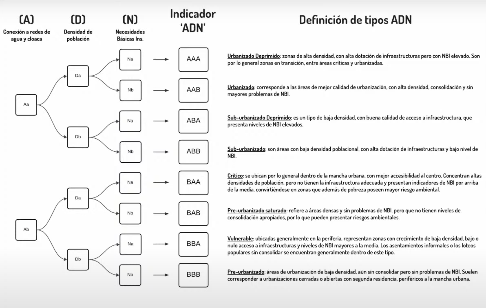

[ADN Urbano](https://www.cippec.org/wp-content/uploads/2017/01/183-DPP-PC2c-Urbano-del-AGBA2c-Gabriel-Lanfranchi2c-Enero-2017.pdf) es una propuesta metodológica de Lanfranchi, Verdecchia y Bidart (2017) que plantea un sistema operativo de lectura del territorio y fácilmente generalizable. El sistema permite clasificar áreas urbanas en distintas categorías, en función de tres indicadores básicos, obtenidos a partir de información que proveen los censos nacionales: 

• Acceso a infraestructuras básicas de servicios (A)

• Densidad de población (D)

• Necesidades básicas insatisfechas (N)

En la práctica, el análisis del ADN Urbano se obtiene del entrecruzamiento de datos desagregados a nivel de radio censal. El indicador ADN Urbano se construye por adición de los resultados obtenidos para cada indicador por separado. Del cruce de los tres indicadores presentados resultan ocho posibles combinaciones entre ellos, construidas a partir de variables dicotómicas para cada dimensión: _con acceso aceptable / con bajo acceso_ a los servicios de agua de red y cloaca, poblacionalmente _densas / poco densas_, y _sin problemas de bienestar / con problemas de bienestar_:

